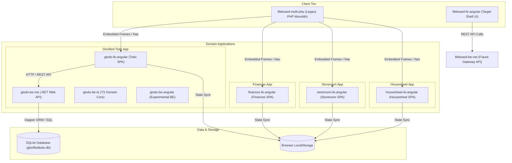

# Lifeboard System Architecture & Topology

## 1. System Overview & Topology

Lifeboard is a modular ecosystem composed of an umbrella repository (`Lifeboard`), containing submoduled domain applications and child project repositories.

```
+-----------------------------------------------------------------------------------+
|                              Lifeboard Umbrella Repo                              |
|                              (Root: /home/g3/.../Lifeboard)                       |
|                                                                                   |
|  Legacy Architecture:                                                             |
|  - lifeboard-multi-php (Root PHP Dashboard: index.php + cabecalho/rodape/css)     |
|                                                                                   |
|  Target Roadmap Architecture:                                                     |
|  - lifeboard-fe-angular (Shell Dashboard SPA)                                    |
|  - lifeboard-be-net (Core Gateway / API Service)                                  |
+-------------------+--------------------+--------------------+---------------------+
                    |                    |                    |
  +-----------------+--+       +---------+-------+      +-----+--------------+
  |     Finances       |       |    Storeroom    |      |    Housesheet      |
  |  (Application Repo)|       |  (Application Repo)|     |  (Application Repo)|
  |  - finances-fe-angular |     |  - storeroom-fe-angular|  |  - housesheet-fe-angular
  +--------------------+       +-----------------+      +--------------------+
                                         |
                       +-----------------+------------------+
                       |          Glorified Todo            |
                       |       (Application Repo)           |
                       |  - gtodo-fe-angular (SPA App)     |
                       |  - gtodo-be-net (.NET Web API)     |
                       |  - gtodo-be-ts (TS Domain Core)    |
                       |  - gtodo-be-angular (Experimental)|
                       +------------------------------------+
```

### Communication Topology (Mermaid)



---

## 2. Naming Conventions & Project Structures

All projects within the `Lifeboard` ecosystem follow the standardized naming taxonomy:

$$\text{\{projectName\}-\{layer\}-\{technology\}}$$

### Taxonomy Matrix

| Field | Definition | Options / Allowed Values | Examples |
| :--- | :--- | :--- | :--- |
| **`projectName`** | Name of the domain application or module (shortened if standard). | `lifeboard`, `gtodo`, `finances`, `housesheet`, `storeroom` | `gtodo`, `lifeboard` |
| **`layer`** | Architectural tier of the specific project. | `fe` (frontend), `be` (backend), `infra` (infrastructure), `multi` (hybrid/monolith) | `fe`, `be`, `multi` |
| **`technology`** | Primary framework, language, or platform used. | `angular`, `net`, `ts`, `php`, `js`, `docker`, `terraform` | `angular`, `net`, `php` |

### .NET Multi-Project Structure Rule
.NET backend repositories (e.g. `gtodo-be-net`) hold all required solution projects directly inside the repository directory structure:
- `gtodo-be-net.Application`: Primary Web API project, controllers, service registrations, and entry point.
- `gtodo-be-net.Tests`: Automated unit and integration test suites.

### Existing & Target Project Mapping

- **Umbrella Repository**: `Lifeboard` (Root)
- **Root Legacy Monolith**: `lifeboard-multi-php`
- **Root Future Shell**: `lifeboard-fe-angular`, `lifeboard-be-net`
- **Glorified Todo Domain**:
  - `glorified-todo/gtodo-app` $\rightarrow$ `gtodo-fe-angular`
  - `glorified-todo/gtodo-be-net` $\rightarrow$ `gtodo-be-net` (`.Application`, `.Tests`)
  - `glorified-todo/gtodo-be-ts` $\rightarrow$ `gtodo-be-ts`
  - `glorified-todo/gtodo-be-angular` $\rightarrow$ `gtodo-be-angular`
- **Finances Domain**:
  - `Finances/finances-app` $\rightarrow$ `finances-fe-angular`
  - `Finances/finances-fe-js` $\rightarrow$ legacy web
- **Housesheet Domain**:
  - `housesheet/housesheet-app` $\rightarrow$ `housesheet-fe-angular`
  - `housesheet/housesheet-multi-js` $\rightarrow$ legacy web
- **Storeroom Domain**:
  - `storeroom/storeroom-app` $\rightarrow$ `storeroom-fe-angular`
  - `storeroom/storeroom-multi-js` $\rightarrow$ legacy web

---

## 3. Multi-Repo & Submodule Hierarchy

`Lifeboard` utilizes multi-level Git submodules to maintain strict domain boundaries while enabling unified umbrella orchestration.

```
Level 0: Umbrella Repository (Lifeboard)
 │
 ├── Level 1: Application Submodule (glorified-todo)
 │    ├── Level 2: Project Submodule (gtodo-fe-angular)
 │    ├── Level 2: Project Submodule (gtodo-be-net)
 │    ├── Level 2: Project Submodule (gtodo-be-ts)
 │    └── Level 2: Project Submodule (gtodo-be-angular)
 │
 ├── Level 1: Application Submodule (Finances)
 │    ├── Level 2: Project Submodule (finances-fe-angular)
 │    └── Level 2: Project Submodule (finances-fe-js)
 │
 ├── Level 1: Application Submodule (housesheet)
 │    ├── Level 2: Project Submodule (housesheet-fe-angular)
 │    └── Level 2: Project Submodule (housesheet-multi-js)
 │
 └── Level 1: Application Submodule (storeroom)
      ├── Level 2: Project Submodule (storeroom-fe-angular)
      └── Level 2: Project Submodule (storeroom-multi-js)
```

---

## 4. Technology Stack LTS Versioning Policy

To guarantee stability, enterprise support, and maintainability, non-LTS "stepping stone" versions are strictly avoided in production code bases.

- **.NET**: Active LTS only (.NET 8.0 LTS or nearest upcoming LTS .NET 10.0). Standard Term Support (STS) versions (such as .NET 9.0) are migration stepping stones.
- **Angular**: Active LTS releases (Angular v18+ LTS).
- **PHP**: Active LTS releases (PHP 8.2 / 8.3 LTS).
- **TypeScript**: TS 5.x+ targeting ES2022 / ESNext standards.
- **Database / ORM**: SQLite (`Microsoft.Data.Sqlite`) with Dapper ORM (`v2.x`).

---

## 5. Agent & Submodule Operational Rules

1. **Submodule Repository Directives**: All code modifications, builds, and test runs MUST be performed directly inside the child submodule project repositories.
2. **Automated Commit Authorization**: On branch `dev/agy` (or `dev-agy`), AI agents are authorized to commit changes automatically.
